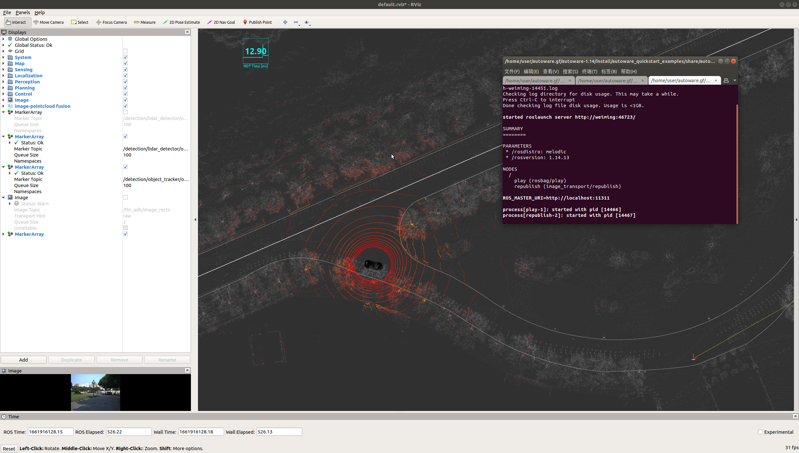
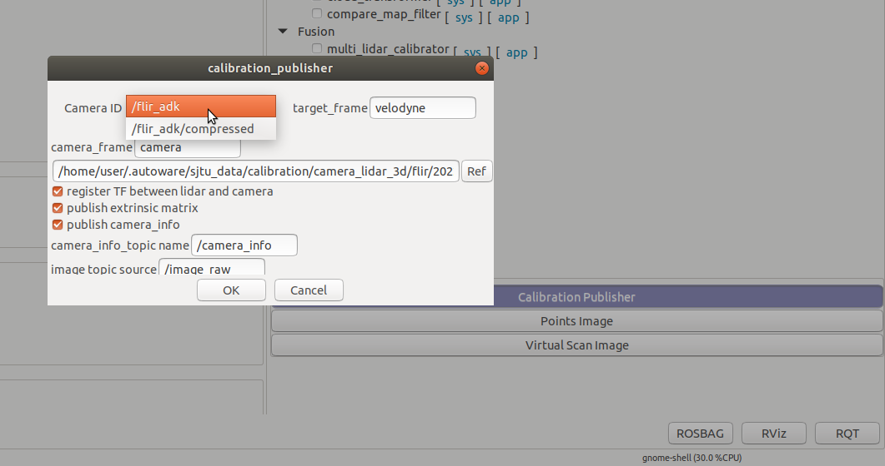
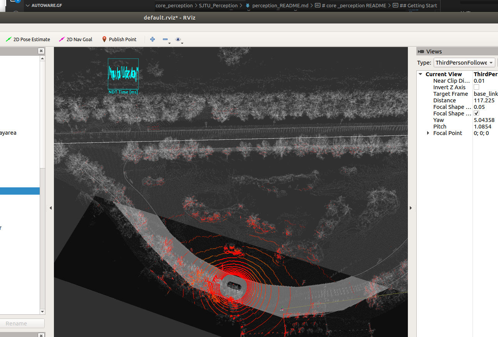
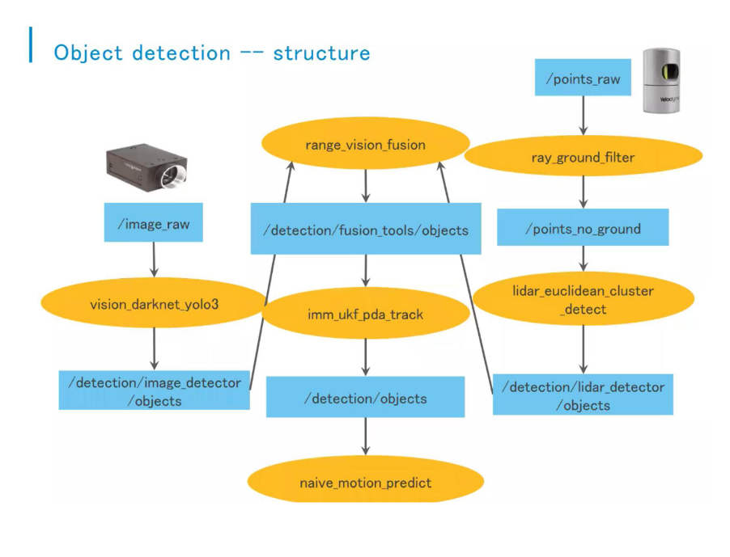

# core _perception README

  ## news
【2022-08-31】：
1. 对感知所有模块进行联合调试，主要包括vision_darknet_detect, lidar_euclidean_cluster_detect, range_vision_fusion 三个模块.
2. 对于track模块，建议使用imm_ukf_pda_track 替换lidar_kf_contour_track.
3. runtime manager ui界面使用，后续也会增加launch文件启动方式

## Getting Start
前期准备需要启动的节点和程序有：

## 【1】. ：相关节点的启动

1.1: 准备工作·：
```bash
 roslaunch  roslaunch autoware_quickstart_examples  sjtu_map.launch    #启动地图数据
 roslaunch  roslaunch autoware_quickstart_examples  sjtu_localization.launch  #启动定位
 roslaunch  roslaunch autoware_quickstart_examples  sjtu_playbag.launch  #启动数据包
```
注意：看看定位成功与否，注意启动顺序。


1.2:  启动runtime manager, 后续所有的工作在该ui界面进行操作（备注：2022-08-31）

```bash
.  install/setup.bash
 roslaunch  runtime_manager runtime_manager.launch
```
注意：

1.2:  **Sensing**，*Points_Perprocessor* 模块，
选择*ray_ground_filter* 节点，主要是进行地面滤除的功能，或使用节点启动

```bash
.  install/setup.bash
 roslaunch  points_preprocessor  ray_ground_filter.launch
```
注意: 这里查看一定订阅节点，在ui一般没有问题


1.3:  **Sensing** ,点击**Calibration  Publisher**，发布相机内参和相机与lidar的RT 矩阵
注意: 界面中原始的Camera ID 需要更改为现在的 /flir_adk,  在播放数据包的情况有一个compressed ，不用这个。


可以检测以下这个文件参数是否正确：Sensing下的Point Image节点，在Rviz中，Panels/Add New Panel内添加ImageViewerPlugin，填写Image Topic，本例为/camrea/rgb/image_raw，Point Topic

**注意**：这里为了保证后续工作，保证Point Image 节点打开


1.4:  **computing** ,点击*vec_pose_connect*，发布实时位姿
注意: 界面中原始的Camera ID 需要更改为现在的 /flir_adk,  在播放数据包的情况


1.5:  **computing** ,点击*wayarea2grid*，发布实时位姿
注释：这里是打开矢量地图中可通行区域，去要在矢量地图中确定绘画了wayarea.或者是roslaunch启动
```bash
.  install/setup.bash
   roslaunch  object_map  wayarea2grid.launch
```
注意：这里启动时，在播放数据的模式下，不能在暂停视频，需要启动播放，然后在rviz里面感知模块可以显示白色区域。


## 【2】. object detection


### 2.1 image 2d detection
**computing** ,点击*vision_darknet_yolo3*，
必须用gpu进行编辑整个文件。
```bash
AUTOWARE_COMPILE_WITH_CUDA=1 colcon build --cmake-args -DCMAKE_BUILD_TYPE=Release 

AUTOWARE_COMPILE_WITH_CUDA=1 colcon build --cmake-args -DCMAKE_BUILD_TYPE=Release  -- packages-select  <宝的名字>
```
注释：这里是利用相机采集的图像数据流，利用YOLO3算法进行检测
需要提前的准备的文件有：.cfg .weight .names
分别是配置文件，训练的权重文件，以及训练选用的coco128训练集

```bash
/home/user/autoware.gf2/autoware-1.14/install/vision_darknet_detect/share/vision_darknet_detect/darknet/cfg/yolov3.cfg

/home/user/autoware.gf2/autoware-1.14/install/vision_darknet_detect/share/vision_darknet_detect/darknet/data/yolov3.weights

/home/user/autoware.gf2/autoware-1.14/install/vision_darknet_detect/share/vision_darknet_detect/darknet/cfg/coco.names
```
**注意** 这里源码里不提供训练好的.weight文件.
在启动节点后，可以查看检测到的物体消息类型
```bash
rostopic echo /detection/image_detector/objects | grep label  #在窗口下会显示lable消息
```
同时在rviz里 add image_rects,就会显示检测结果.

**注意注意注意**，当在窗口显示label 消息后，但是一直不显示在rviz 里面，这里需要修改显示源码 ，可以在yolo3_detect.launch文件中看到发布的节点名字和类型 visualize_rects ，visualization/detected_objects_visualizer/src/visualize_rects.cpp
```bash
  <node pkg="detected_objects_visualizer" type="visualize_rects" name="yolo3_rects"
        output="screen">
    <param name="image_src" value="$(arg image_src)"/>
    <param name="image_out" value="/image_rects"/>
    <param name="object_src" value="/detection/image_detector/objects"/> <!-- this is fixed by definition -->
  </node>
```

```bash

image_filter_subscriber_ = new message_filters::Subscriber<sensor_msgs::Image>(private_nh_,
                                                                                 image_src_topic,
                                                                                          2);
  ROS_INFO("[%s] image_src: %s", __APP_NAME__, image_src_topic.c_str());
  detection_filter_subscriber_ = new message_filters::Subscriber<autoware_msgs::DetectedObjectArray>(private_nh_,
                                                                                                     object_src_topic,
                                                                                            2);
  ROS_INFO("[%s] object_src: %s", __APP_NAME__, object_src_topic.c_str());

  detections_synchronizer_ =
    new message_filters::Synchronizer<SyncPolicyT>(SyncPolicyT(10),
                                                   *image_filter_subscriber_,
                                                   *detection_filter_subscriber_);
  detections_synchronizer_->registerCallback(
    boost::bind(&VisualizeRects::SyncedDetectionsCallback, this, _1, _2));
```
分别在47 51  55行修改缓存的熟知，时间同步出问题，一直进步了回调函数，就不能发布代框子的图片。修改稍微大一点然后进行编译
```bash
AUTOWARE_COMPILE_WITH_CUDA=1 colcon build --cmake-args -DCMAKE_BUILD_TYPE=Release --packages-select detected_objects_visualizer
```
至此完成yolo3检测的内容.

###  2.2 lidar 点云欧式聚类检测。
**computing** ,点击*lidar_euclidean_cluster_detect*
 注释：这里就是利用雷达获取的点云，利用欧式聚类的方法，进行检测，检测成功后会显示一个蓝色框子和数值。
**注释**：这里输入的点云是points_no_ground, 所以必须打开ray_ground_filter节点，查看 是否发布topic.

    该节点输出的topic：/detection/lidar_detector/objects, 
    如果使用use_vector_map,还会发布一个/detection/lidar_detector/objects_filtered.
    app里面的参数 out_frame :velodyne .

**注意**：欧式聚类的参数，修改的地方有clustering_distance 设置的数值可以较小  0.5m， cluster_merge_diantance  0.6


## 3 融合检测。
点云和图像之间的融合
    **注释**：1. 这里需要融合检测的需要发布相机rt矩阵和内参，所以前面的**Calibration  Publisher** 必须输出结果
                  
    输入：图像检测结果/detection/image_detector/objects, 
                  点云检测结果//detection/lidar_detector/objects, or /detection/lidar_detector/objects_filtered. 

     输出：图像结果/detection/fusion_tools/objects_filtered #是一个蓝色的矩阵，并加上名字 名字如下
   2. 这里的融合输出结果是结合图像检测的label，其中只有四个融合模型，
   range_vision_fusion.app   298行
   ```bash
  if (in_out_object.label == "car")
  {
    if (in_out_object.dimensions.x < car_depth_)
      in_out_object.dimensions.x = car_depth_;
    if (in_out_object.dimensions.y < car_width_)
      in_out_object.dimensions.y = car_width_;
    if (in_out_object.dimensions.z < car_height_)
      in_out_object.dimensions.z = car_height_;
  }
  if (in_out_object.label == "person")
  {
    if (in_out_object.dimensions.x < person_depth_)
      in_out_object.dimensions.x = person_depth_;
    if (in_out_object.dimensions.y < person_width_)
      in_out_object.dimensions.y = person_width_;
    if (in_out_object.dimensions.z < person_height_)
      in_out_object.dimensions.z = person_height_;
  }

  if (in_out_object.label == "truck" || in_out_object.label == "bus")
  {
    if (in_out_object.dimensions.x < truck_depth_)
      in_out_object.dimensions.x = truck_depth_;
    if (in_out_object.dimensions.y < truck_width_)
      in_out_object.dimensions.y = truck_width_;
    if (in_out_object.dimensions.z < truck_height_)
      in_out_object.dimensions.z = truck_height_;
  }
   ```


  ## 4  track追踪模块。
  这里主要用到的追踪模块是 lidar_imm_ukf_pda_track.
  **注释**：1. 这里修改的参数中，merge_distance_threshold 可以设置 0.5

    输入：/detection/lidar_detector/objects, 自己进行选择。
    输出：/detection/object_tracker/objects；


  ## 5   native_motion_predict 追踪模块。

      输入：/detection/object_tracker/objects, 自己进行选择。
      输出：/prediction/motion_predictor/objects
                  

