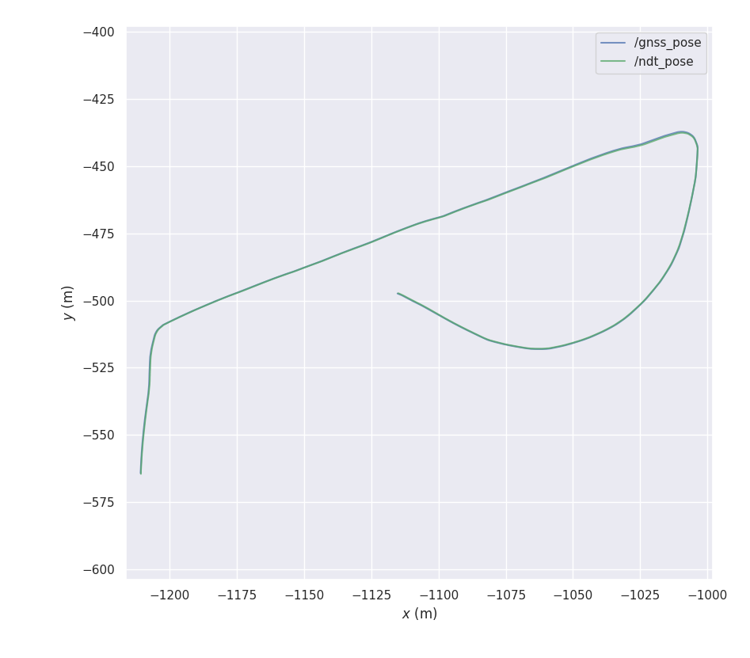
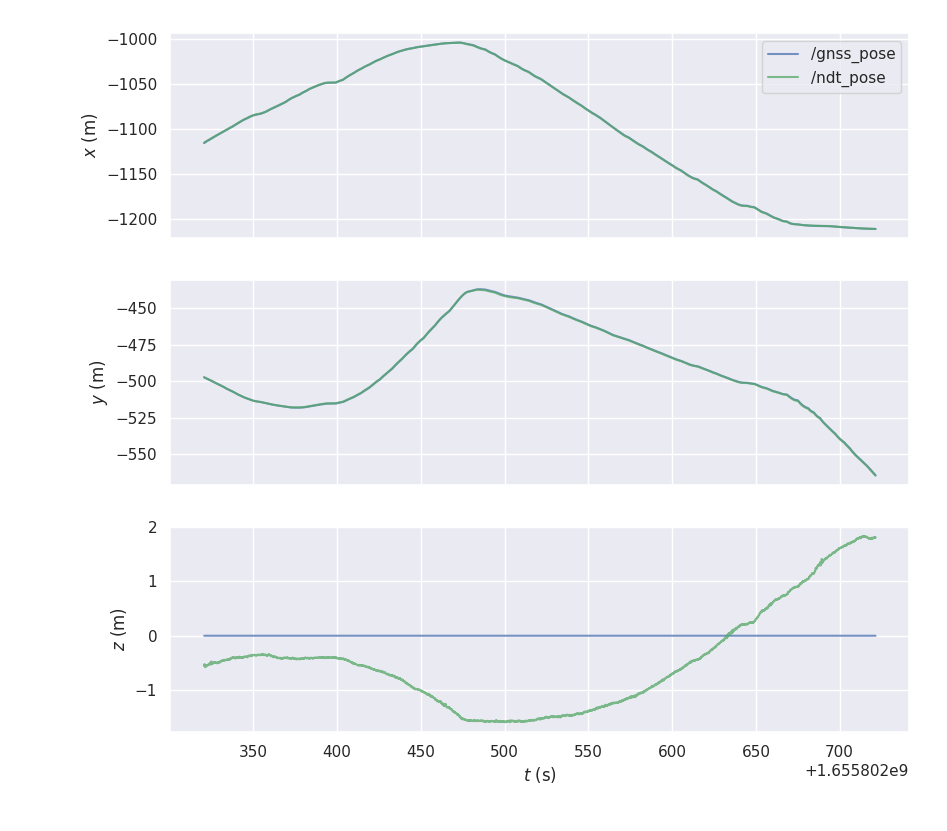
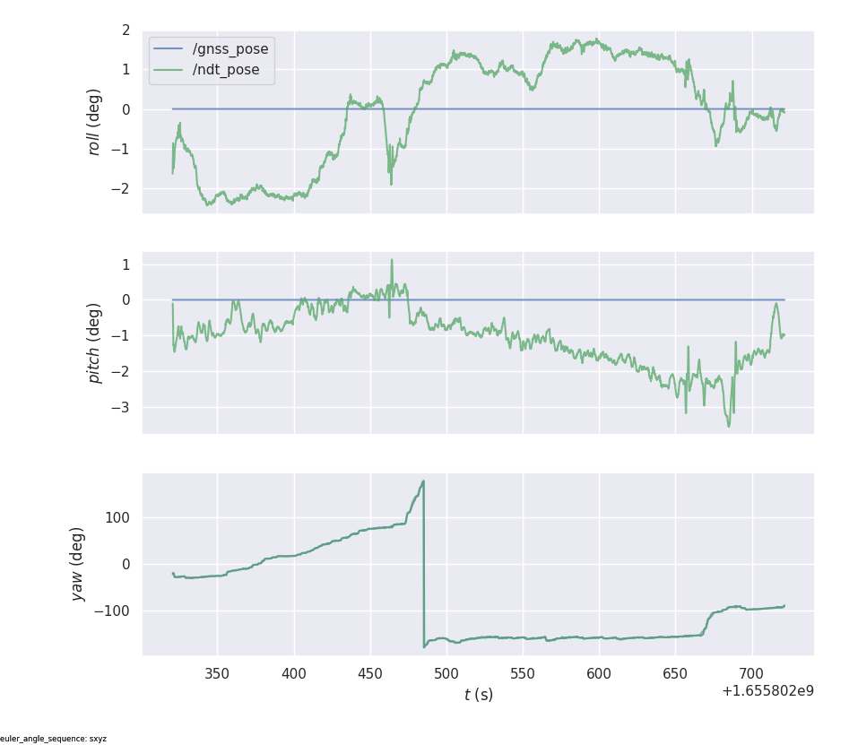
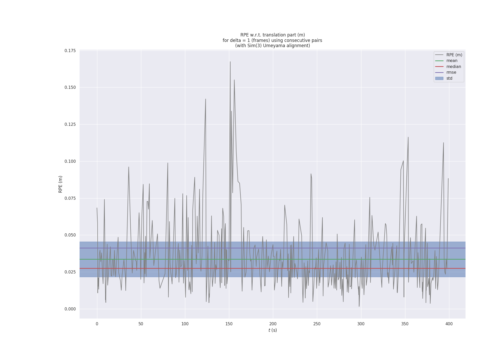
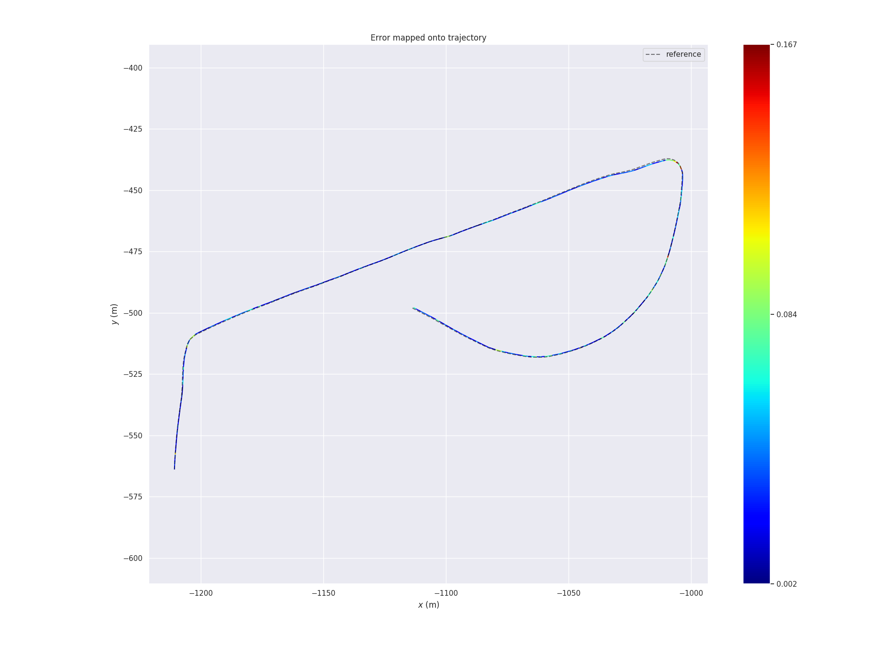
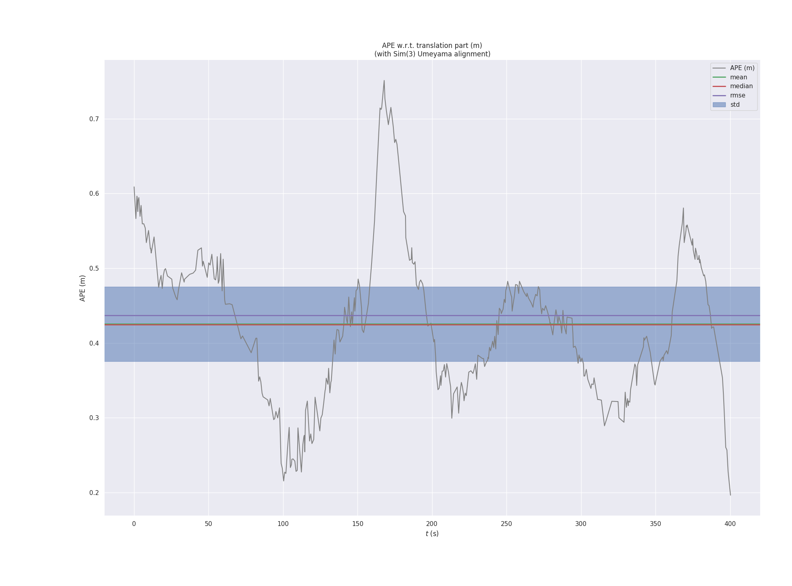
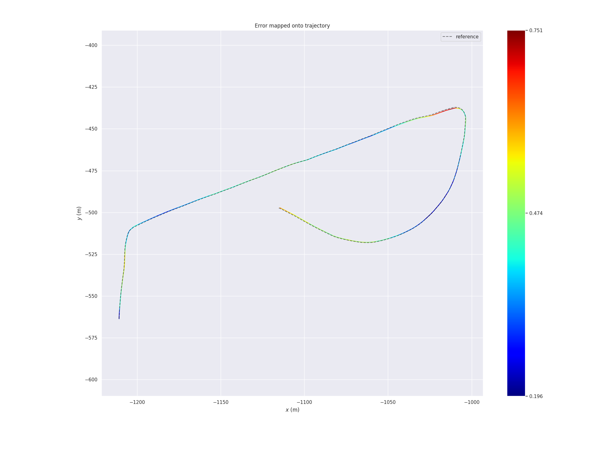

# evaluation of SLAM

- [SLAM的精度评价标准是什么？ - 刘国庆的回答 - 知乎](https://www.zhihu.com/question/485606304/answer/2111805839)

# 常用轨迹精度的定量评估工具
## EVO
-  [MichaelGrupp/evo - Github](https://github.com/MichaelGrupp/evo/tree/master) 

### 安装
```bash
$ pip install evo --upgrade --no-binary evo
$ echo "export PATH=$PATH:$HOME/.local/bin" >> ~/.bashrc
```

### 录制数据包
以RTK定位(`/gnss_pose`)为参考值，对雷达定位(`/ndt_pose`)进行评估, 因此需要在`ndt_matching`成功后录制这两个话题到数据包中.

```bash
$ rosbag record /tf /ndt_pose /gnss_pose
$ rosbag info 2022-07-14-20-22-31.bag 
path:        2022-07-14-20-22-31.bag
version:     2.0
duration:    6:40s (400s)
start:       Jul 14 2022 20:22:35.32 (1657801355.32)
end:         Jul 14 2022 20:29:16.05 (1657801756.05)
size:        1.7 MB
messages:    12140
compression: none [3/3 chunks]
types:       geometry_msgs/PoseStamped [d3812c3cbc69362b77dc0b19b345f8f5]
             tf2_msgs/TFMessage        [94810edda583a504dfda3829e70d7eec]
topics:      /gnss_pose   2061 msgs    : geometry_msgs/PoseStamped
             /ndt_pose    4009 msgs    : geometry_msgs/PoseStamped
             /tf          6070 msgs    : tf2_msgs/TFMessage        (2 connections)

```

### 使用EVO评估SLAM精度
1. 绘制`/gnss_pose`和`/ndt_pose`两个话题的轨迹
```bash
$ evo_traj bag 2022-07-14-20-22-31.bag --all_topics -p --plot_mode xy
```

<div align="center">



</div> 

2. 将rosbag数据包转换为其他格式(非必要),再进行精度评估
```bash
$ evo_traj bag 2022-07-14-20-22-31.bag --all_topics --save_as_tum
$ evo_ape tum gnss_pose.tum ndt_pose.tum -a -p -s
APE w.r.t. translation part (m)
(with Sim(3) Umeyama alignment)

       max	0.751198
      mean	0.425449
    median	0.424658
       min	0.196403
      rmse	0.436956
       sse	75.990423
       std	0.099617

$ evo_rpe tum gnss_pose.tum ndt_pose.tum -a -p -s
RPE w.r.t. translation part (m)
for delta = 1 (frames) using consecutive pairs
(with Sim(3) Umeyama alignment)

       max	0.167373
      mean	0.033602
    median	0.027425
       min	0.001626
      rmse	0.041215
       sse	0.674386
       std	0.023866
```
3. 使用 rosbag 进行精度评估
```bash
usage: evo_rpe bag [-h] [-r {full,trans_part,rot_part,angle_deg,angle_rad}]
                   [-a] [-s] [--n_to_align N_TO_ALIGN] [--align_origin]
                   [-d DELTA] [-t DELTA_TOL] [-u {f,d,r,m}] [--all_pairs] [-p]
                   [--plot_mode {xy,xz,yx,yz,zx,zy,xyz}]
                   [--plot_colormap_max PLOT_COLORMAP_MAX]
                   [--plot_colormap_min PLOT_COLORMAP_MIN]
                   [--plot_colormap_max_percentile PLOT_COLORMAP_MAX_PERCENTILE]
                   [--plot_full_ref] [--ros_map_yaml ROS_MAP_YAML]
                   [--save_plot SAVE_PLOT] [--serialize_plot SERIALIZE_PLOT]
                   [--save_results SAVE_RESULTS] [--logfile LOGFILE]
                   [--no_warnings] [-v] [--silent] [--debug] [-c CONFIG]
                   [--t_max_diff T_MAX_DIFF] [--t_offset T_OFFSET]
                   bag ref_topic est_topic

$ evo_rpe bag -a -s -p --plot_mode xy 2022-07-14-20-22-31.bag /gnss_pose /ndt_pose
RPE w.r.t. translation part (m)
for delta = 1 (frames) using consecutive pairs
(with Sim(3) Umeyama alignment)

       max	0.167373
      mean	0.033602
    median	0.027425
       min	0.001626
      rmse	0.041215
       sse	0.674386
       std	0.023866
```


<div align="center">


</div> 


```bash
$ evo_ape bag -a -s -p --plot_mode xy 2022-07-14-20-22-31.bag /gnss_pose /ndt_pose
APE w.r.t. translation part (m)
(with Sim(3) Umeyama alignment)

       max	0.751198
      mean	0.425449
    median	0.424658
       min	0.196403
      rmse	0.436956
       sse	75.990423
       std	0.099617


```

<div align="center">


</div> 
