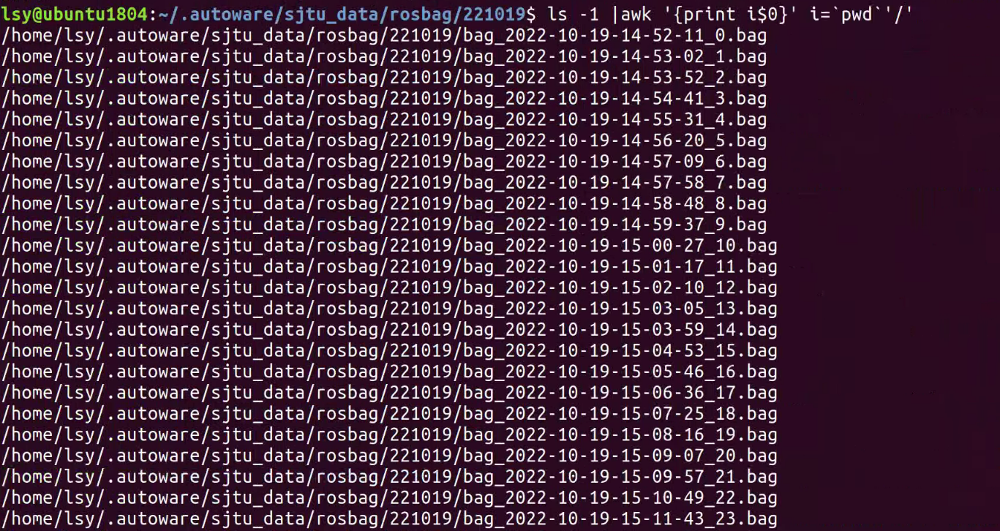
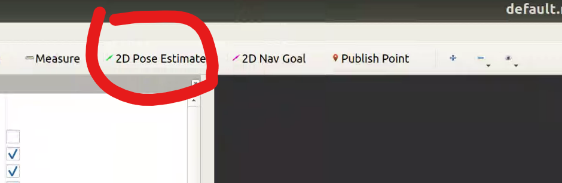
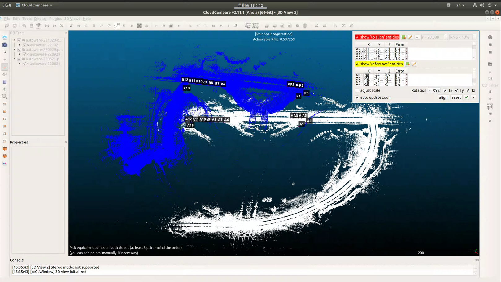
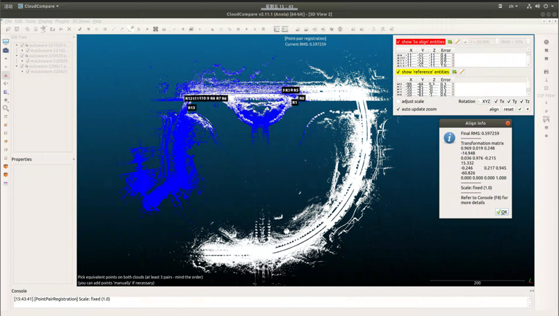
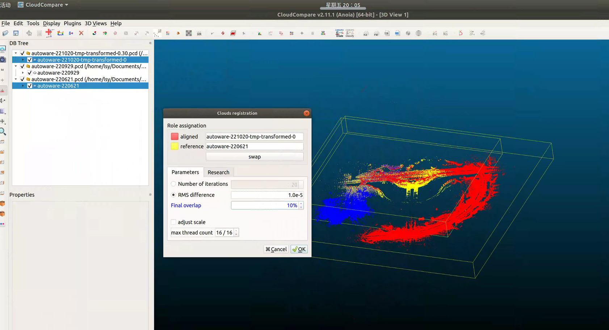
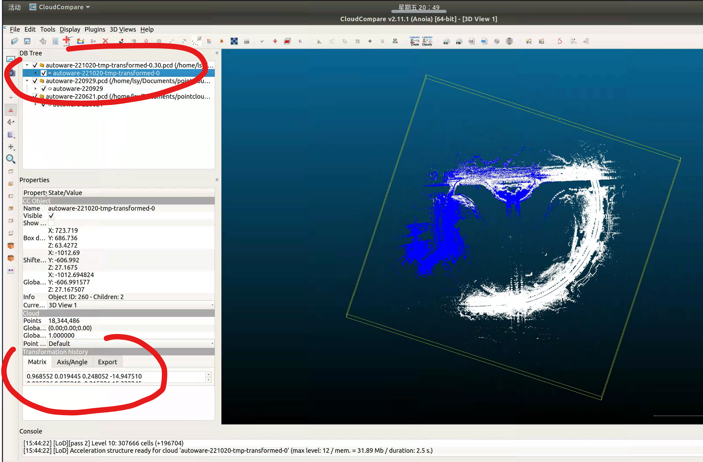

# 建图基本流程

## 构建点云地图
### ndt_mapping
1. 开始建图
   建图的操作已经全部整理到了 [sjtu_demo/build_map/sjtu_playbag_mapping.launch](https://github.com/AutonomousRobot/autoware.gf/blob/487cd3364b051252051888666c248e05064f16c5/autoware-1.14/src/autoware/documentation/autoware_quickstart_examples/launch/sjtu_demo/build_map/sjtu_playbag_mapping.launch) 文件中，可直接执行: 
   ```bash
    $ roslaunch autoware_quickstart_examples sjtu_playbag_mapping.launch
   ```
    - [获得当前目录下所有数据包的完整路径](https://www.cnblogs.com/whm-blog/p/11849127.html)
      ```
      ls -1 | awk '{print i$0}' i=`pwd`'/'
      ```
      <div align=left>
      
      </div>

2. 保存点云地图
    如果使用`runtime_manager`运行`ndt_mapping`, 那么可以在界面中点击`PCD OUTPUT`将构建好的点云地图输出为`.pcd`文件。

    此外还可以通过`pcl_ros`功能包订阅点云消息，输出到文件： 
   ```bash
   $ rosrun pcl_ros pointcloud_to_pcd input:=/ndt_map
   [ INFO] [1666285094.946293395]: Saving as ASCII PCD
   [ INFO] [1666285094.947435864]: Listening for incoming data on topic /ndt_map
   [ INFO] [1666285096.837169451]: Received 25532040 data points in frame map with the following fields: x y z intensity
   [ INFO] [1666285096.837197772]: Data saved to 0.pcd
   ^C
   ```
   **注意**   
    1. 终端显示 `Data saved to 0.pcd` 之后必须立即执行 `Ctrl+C` 终止进程，否则该程序会继续监听话题上的点云消息，然后覆盖掉点云文件;
    2. 必须在建图的过程中执行该指令，保证该话题上持续有消息发布，而不能等到建图完成之后，否则将持续监听话题却接收不到消息，无法保存点云地图。

   稍等片刻，或执行 `ls -lh` 判断文件写入完毕，然后对文件重命名，以免后续被覆盖
   ```bash
   $ ls -lh
   $ mv 0.pcd ~/.autoware/sjtu_data/map/pointcloud_map/autoware-221020-tmp.pcd
   ```

3. 降采样(optional)
   如果点云地图太大，可以选择对其进行降采样再执行后续步骤，
   或者最终完成坐标转换之后再降采样。  
   在 autoware `Runtime Manager -> Map -> Map Tool -> PCD Filter` 界面集成了点云地图降采样的功能, 可自行选择体素滤波的参数, 注意点云类型应当选择 `PointXYZI`.  

### cartographer建图
略

### 点云地图坐标变换
为了统一坐标系，将前面构建的点云地图`.pcd`文件转换到`gnss`参考点坐标系.

1. 使用前面构建的点云地图进行定位，手动在rviz界面指定初始位姿(记下定位成功时的时间戳)，并录制 `gnss_pose` 和 `ndt_pose` 话题，得到 `bag_gnss_ndt.bag`  
   启动 ndt_matching、播放数据包、录制话题等操作已经全部写到 [sjtu_demo/build_map/sjtu_get_transform_map2gnss.launch](https://github.com/AutonomousRobot/autoware.gf/blob/487cd3364b051252051888666c248e05064f16c5/autoware-1.14/src/autoware/documentation/autoware_quickstart_examples/launch/sjtu_demo/build_map/sjtu_get_transform_map2gnss.launch) 文件中，可以直接执行，但仍然在rviz中手动指定 ndt_matching 的初始位姿
   ```bash
   $ roslaunch autoware_quickstart_examples sjtu_get_transform_map2gnss.launch
   ```
   <div align=left>
   
   </div>

2. 由于手动指定 ndt_matching 的初始位姿需要花费一定时间，录制的`bag_gnss_ndt.bag`前面有一小段(约100s)可能没有定位成功，使用`rosbag filter`截去
   ```bash
    $ rosbag filter input.bag output.bag "t.to_sec() >= 1284703931.86"
   ```

   示例
   ```bash
   lsy@ubuntu1804:~/.autoware/sjtu_data/map/pointcloud_map$ rosbag info bag_gnss_ndt_2022-10-21-13-09-47.bag
   path:        bag_gnss_ndt_2022-10-21-13-09-47.bag
   version:     2.0
   duration:    11:53s (713s)
   start:       Oct 21 2022 13:09:47.65 (1666328987.65)
   end:         Oct 21 2022 13:21:41.33 (1666329701.33)
   size:        1.2 MB
   messages:    9701
   compression: none [2/2 chunks]
   types:       geometry_msgs/PoseStamped [d3812c3cbc69362b77dc0b19b345f8f5]
   topics:      /gnss_pose   3083 msgs    : geometry_msgs/PoseStamped
                /ndt_pose    6618 msgs    : geometry_msgs/PoseStamped
   lsy@ubuntu1804:~/.autoware/sjtu_data/map/pointcloud_map$ rosbag filter bag_gnss_ndt_2022-10-21-13-09-47.bag  output.bag "t.to_sec() >= 1666329087.65"
    output.bag                                                           100%              1.1 MB 00:00    
   lsy@ubuntu1804:~/.autoware/sjtu_data/map/pointcloud_map$ rosbag info output.bag
   path:        output.bag
   version:     2.0
   duration:    10:13s (613s)
   start:       Oct 21 2022 13:11:27.70 (1666329087.70)
   end:         Oct 21 2022 13:21:41.33 (1666329701.33)
   size:        1.1 MB
   messages:    8783
   compression: none [2/2 chunks]
   types:       geometry_msgs/PoseStamped [d3812c3cbc69362b77dc0b19b345f8f5]
   topics:      /gnss_pose   2645 msgs    : geometry_msgs/PoseStamped
                /ndt_pose    6138 msgs    : geometry_msgs/PoseStamped

   ```

3. 使用pix提供的脚本估计 map 坐标系与 gnss参考点 坐标系的变换矩阵
   
   先录制 `/gnss_pose` 和 `/ndt_pose` 两个话题, 得到一个 rosbag 数据包, 分别表示汽车相对于 GPS 参考点的位姿和相对于点云地图的位姿, 然后通过 Python 脚本读取并分析该数据包, 脚本会在终端打印出 GPS 参考点坐标系 相对于 点云地图坐标系 的旋转矩阵和平移向量, 使用这两个坐标系之间的变换关系可以将点云地图转换到 GPS 参考点坐标系.

   ```bash
   lsy@ubuntu1804:~/autoware.gf2/utils/gnss_conv$ python geo_extract_bag.py ~/.autoware/sjtu_data/map/pointcloud_map/output.bag 
   extract bag: /home/lsy/.autoware/sjtu_data/map/pointcloud_map/output.bag
   r matrix:

   [[ 0.88071515  0.45869001  0.11808597]
    [-0.40196688  0.85569943 -0.32588513]
    [-0.25052635  0.23954533  0.93800564]]
   t matrix:

   [1310.06119503  272.07753989  -53.45975772]


   a-aa mean error:

   [0.58323104 0.2294428  1.02510056]
   ('c-test_b:\n', array([0.50173591, 0.26440983, 1.14328733]))

   ```
   将上面计算得到的旋转和平移矩阵组合成变换矩阵，写入一个 transform.txt 文件中
   ```
   0.88071515  0.45869001  0.11808597  1310.06119503 
   -0.40196688  0.85569943 -0.32588513 272.07753989
   -0.25052635  0.23954533  0.93800564 -53.45975772
   0 0 0 1
   ```
4. 使用`./transform_pointcloud`程序将前面的点云地图变换到gnss参考点坐标系
   ```bash
   lsy@ubuntu1804:~/autoware.gf2/utils/pointcloud_process/build$ ./transform_pointcloud ~/.autoware/sjtu_data/map/pointcloud_map/autoware-221020-tmp.pcd ~/.autoware/sjtu_data/map/pointcloud_map/transform.txt -i
   use the inverse matrix to transform pointcloud
   loading point cloud from file: /home/lsy/.autoware/sjtu_data/map/pointcloud_map/autoware-221020-tmp.pcd
   points num: 18344486
   Transforming cloud with a Matrix4f
   transform 
    0.880715   0.45869  0.118086   1310.06
   -0.401967  0.855699 -0.325885   272.078
   -0.250526  0.239545  0.938006  -53.4598
           0         0         0         1
   transform^{-1} 
    0.880715 -0.401967 -0.250526  -1057.82
     0.45869  0.855699  0.239545  -820.922
    0.118086 -0.325885  0.938006  -15.8883
          -0        -0        -0         1
   saving transformed points_map to file: /home/lsy/.autoware/sjtu_data/map/pointcloud_map/autoware-221020-tmp-transformed/autoware-221020-tmp-transformed.pcd

   ```
   其中 `-i` 参数表示使用给定矩阵的逆矩阵对输入的点云进行坐标变换.  
   如下图蓝色点云是之前构建的地图，白色是新建的地图，且变换到了参考点坐标系
   <div align=left>
   
   </div>
5. 精配准  
   如果是增量建图，即在目标区域附近事先已有一部分点云地图，那么新建的点云地图即便统一转换到了gnss参考点坐标系也可能与之前的点云地图
   存在一定偏差  
   此时可以选择用 CloudCompare 对两部分点云地图进行精配准，并记录下变换矩阵，然后用`./transform_pointcloud`程序将新的地图再进行一次坐标变换，得到最终可以使用的点云地图, 放入  `.autoware/sjtu_data/map/pointcloud_map/` 文件夹使用。

   CloudCompare 有两种配准方法：基于点对进行配准；基于icp配准。  
   如下是先后使用这两种配准方法得到的配准效果图：  
   <div align=left>
   
   </br>
   
   </br>
   </div>

## 绘制矢量地图


