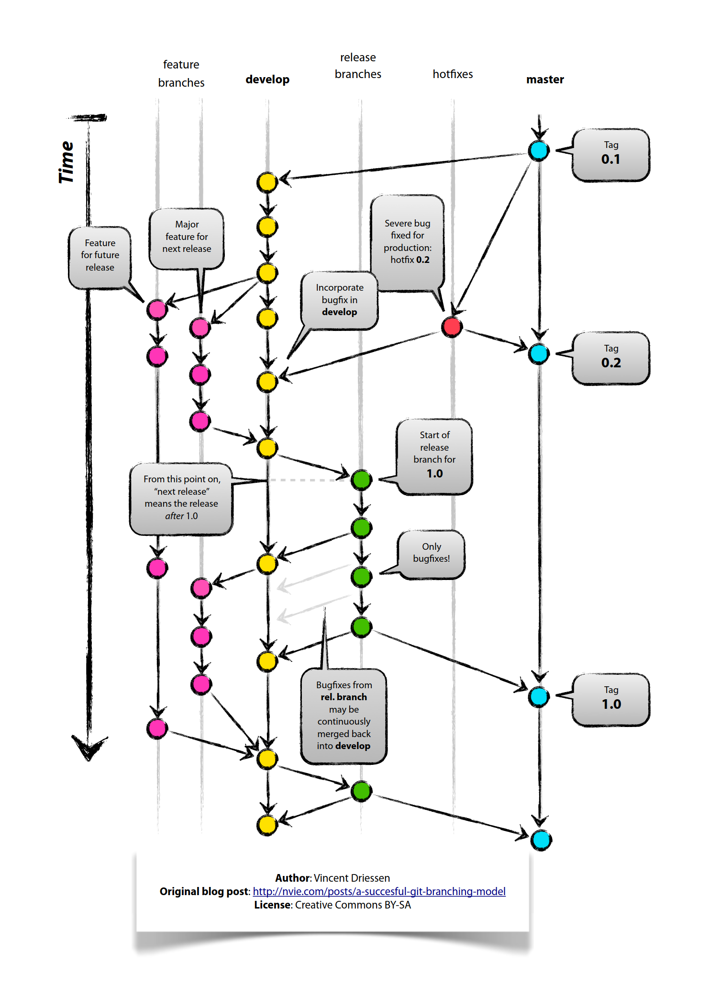
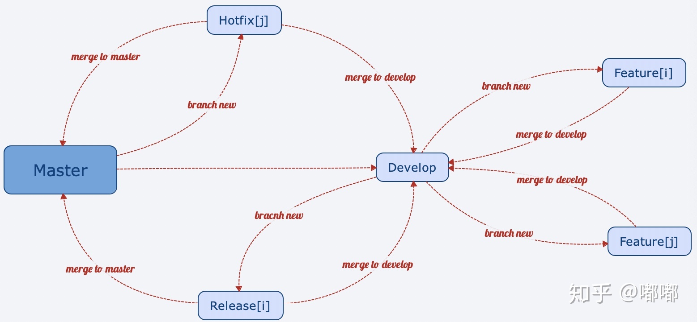

# Git Flow
# 为什么要使用 Git Flow？
为了方便进行团队协作以及项目部署.   
在以往的项目开发过程中, 团队成员在各自电脑上独立地进行开发, 然后通过 U 盘拷贝到车载电脑上进行实车部署测试, 发现问题后又直接在车载电脑上调试, 这种原始的工作模式导致团队成员各自的工作代码和车载电脑上运行的代码都各不相同, 有时甚至搞不清楚车载电脑上的某部分代码来自哪里, 造成极大的混乱, 影响工作效率.   
为了解决这个问题, 创建了本仓库, 用来管理本项目相关的代码. 今后开发中, 应当以本仓库为基础, 进行分支创建、开发、合并等操作, 维护项目代码的一致性, 同时保证每一部分代码的更新都是可追溯的.

# 如何使用 Git Flow?
使用 Git 进行团队协作开发不可避免的涉及分支的创建与合并等操作, 为了维护 Git 分支结构清晰, 让大家有效地合作，必须要有一个规范的工作流程 (Work Flow). 工作流程的设计应该符合团队的规模、协作模式、项目特性等. 前人已经发明了多种基于 Git 协作的工作流, 长期以来被广泛使用.  
- [四种常见的Git工作流 - 知乎: 杨世伟](https://zhuanlan.zhihu.com/p/434078984) 
- [Git 工作流程 - 阮一峰](https://www.ruanyifeng.com/blog/2015/12/git-workflow.html) 

本项目使用 [Vincent Driessen, 2010](https://nvie.com/posts/a-successful-git-branching-model/) 提出的 `Git Flow` 进行协作开发.   
详细规范以及操作指令主要可以参考如下两个博客文章进行深入学习.  
- [A successful Git branching model - Vincent Driessen](https://nvie.com/posts/a-successful-git-branching-model/)
- [Git 在团队中的最佳实践--如何正确使用Git Flow - 敏捷的水](https://www.cnblogs.com/cnblogsfans/p/5075073.html)

补充:   
- [Git flow 规范 - 知乎: reexpound](https://zhuanlan.zhihu.com/p/66048537)
- [一文读懂Git工作流 - 知乎: ForTheDevelopers](https://zhuanlan.zhihu.com/p/266916800)
- [图解git flow开发流程 - 知乎: 师否](https://zhuanlan.zhihu.com/p/198066289)
- [Git分支管理策略 - 阮一峰](https://www.ruanyifeng.com/blog/2012/07/git.html)

这里对 `Git Flow` 的核心部分进行简要介绍. 其分支模型图如下.  

 

`Git Flow` 的分支模型中包含如下分支:  
- `master`: 主分支, 代码库应该有且仅有一个主分支. 所有提供给用户使用的正式版本，都在这个主分支上发布. `master` 分支必须时常保持着软件可以正常运行的状态, 所以不允许开发者直接对 `master` 分支的代码进行修改和提交. 只有在预发布分支 `release` 分支经过充分测试后, 被合并到 `master` 分支; 或者 `master` 分支的代码在日常运行中出现 bug, 然后创建 `hotfix` 分支修复 bug 后合并到 `master` 分支. 每发布一个 `master` 分支, 都必须打上 `tag`, 分配版本号并附带相关说明.  
  - [语义化版本格式: x.y.z](https://semver.org/lang/zh-CN/)
  - x: 主版本号, 在重大功能变更，或者版本不向下兼容时 +1, 此时 y, z 归零
  - y: 次版本号, 在添加新功能或者删除已有功能时 +1, 此时 z 归零
  - z: 修订号, 只在进行内部问题修改后 +1.
- `develop`: 主开发分支, 是开发过程中代码中心分支. 与 `master` 分支一样，这个分支也不允许开发者直接进行修改和提交. 程序员要以 `develop` 分支为起点新建 `feature` 分支, 在 `feature` 分支中进行新功能的开发或者代码的修正. 也就是说 `develop` 分支维系着开发过程中的最新代码，以便程序员创建 `feature` 分支进行自己的工作. 当所有新功能开发完成后, 开发人员自测完成后, 此时从 `develop` 创建 `release` 分支, 进行预发布.
- `release`: 预发布分支, 在这个分支，我们只处理与发布前准备相关的提交，如果 `release` 分支存在很小的 bug, 应当就地修正, 该分支绝对不能包含需求变更或者功能变更等重大修正, 这一阶段的提交数应该限制到最低. 当 `release` 分支准备好真正发布时, 应当合并到 `master` 分支, 并给 `master` 分支打上 `tag`, 然后将 `feature` 分支合并到 `develop` 分支, 确保小 bug 的修正也被合并回去.
- `hotfix`: 补丁分支, 当 `master` 分支中出现重大漏洞时, 派生出 `hotfix` 分支进行修复, 然后合并回 `master` 分支以及 `develop` 分支.
- `feature`: 功能开发分支, 以 `develop` 分支为起点, 创建 `feature` 分支, 进行代码开发, 实现目标功能, 然后合并回到 `develop` 分支. 与 `develop` 分支合并后, 已经完成工作的 `feature` 分支可以在适当的时机删除. 

基于以上分支模型, 本项目团队开发人员应当在自己的开发环境中从 `develop` 分支创建各自的 `feature` 分支进行功能开发, 完成后合并到 `develop` 分支, 并在开发者自己的电脑环境中对该分支进行充分测试, 若有必要, 则进行实车调试. 
经过多次测试无误后, 合并到预发布版本 `release` 分支, 进行简单检查后, 再正式发布到 `master` 分支, 并分配版本号.

