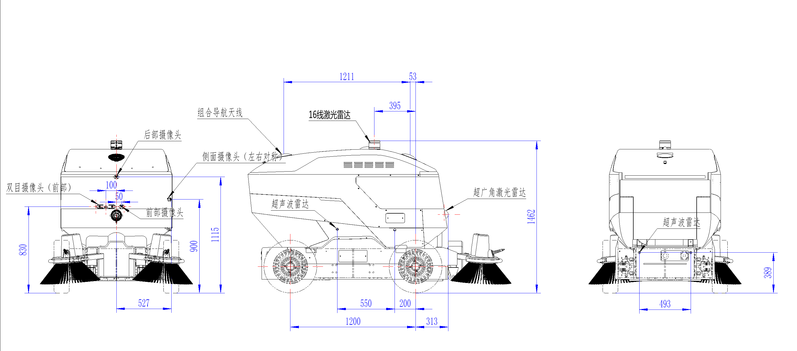
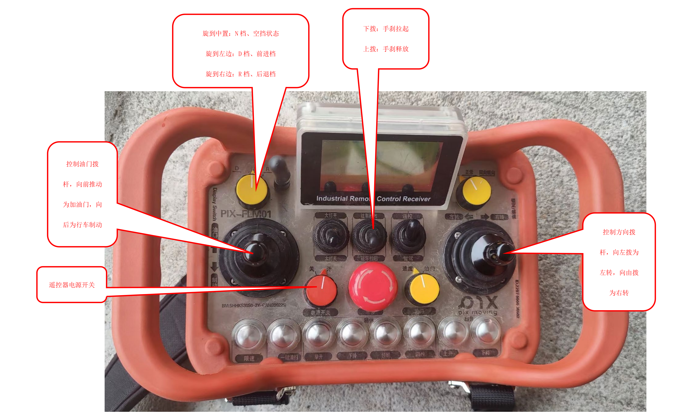
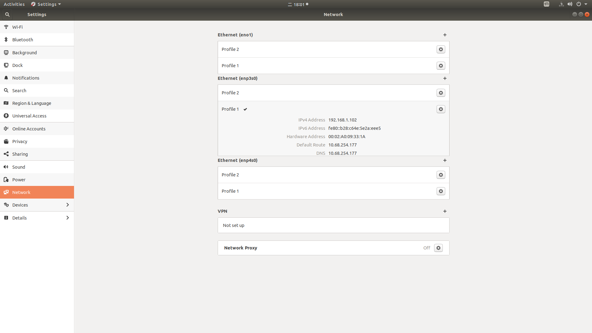
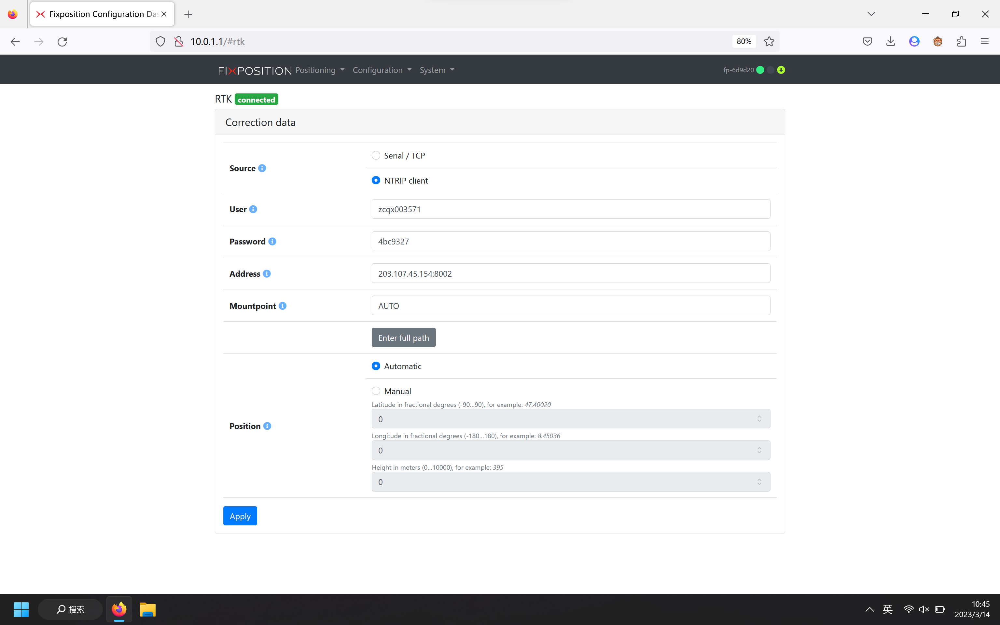
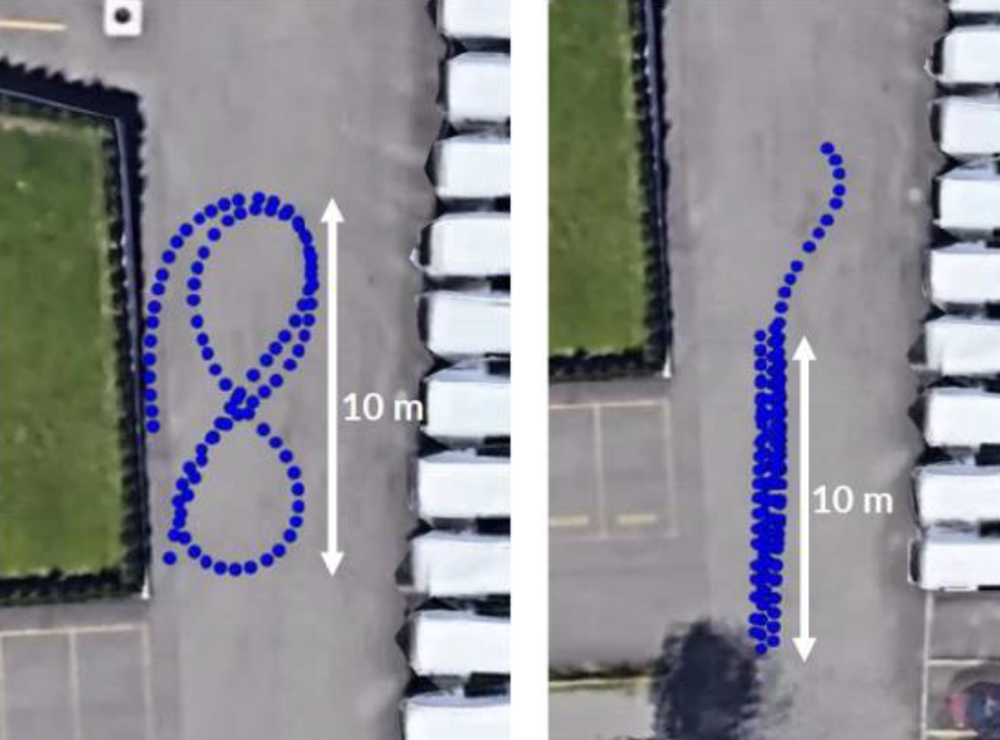
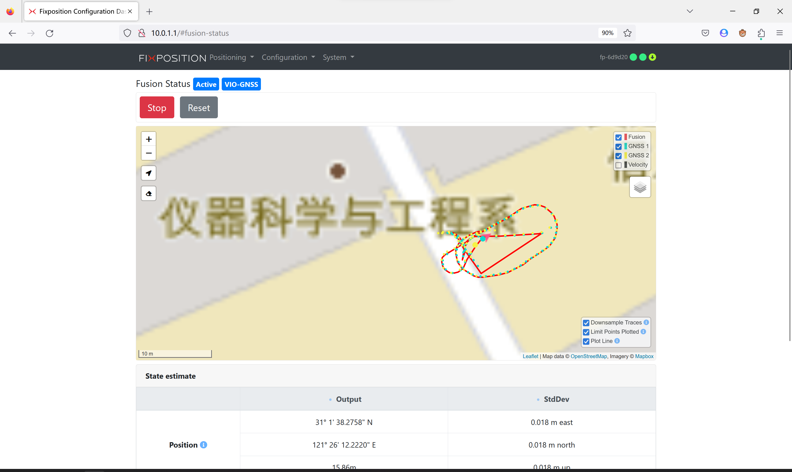
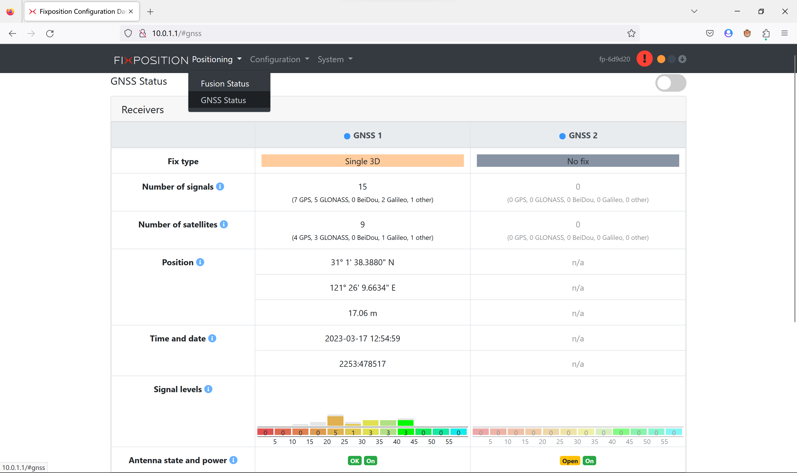

# 传感器驱动测试
车载传感器主要包括
- `激光雷达`
  - 16 线机械式激光雷达 r obosense RS-Helios-16P, FOV 30°, 安装于车辆顶端
  - 32 线超广角补盲激光雷达 robosense Bpearl, FOV 90°, 安装于车辆正前方
- `USB 相机`: 森云
- `ZED 双目相机`
- `组合导航`: `Fixposition Vision-RTK 2`
- `超声波雷达探头`: `CM 8 pack`, FOV 60°, 安装于车辆四周
- `4g/5g CPE`: `zlwl ZS9721`, 车联网
- `工控机`: 集合诚 jhctech 7520

2.0 款汽车上所有传感器都已经安装完成, 无需手动接线.

<div align="center">

</div> 

这些传感器的驱动程序在 `catkin_ws/ros_driver` 文件夹中. 参考如下文档完成驱动编译：
- [编译传感器驱动](build_ros_driver.md)


# 底盘
- [无人清扫车BSP01底盘使用维护手册](pdf/无人清扫车BSP01底盘使用维护手册-v1.0.pdf)

- [CBSD1501BEV遥控操作指导](pdf/CBSD1501BEV遥控操作指导.pdf)

<div align="center">

</div> 

1. 垃圾箱操作  
遥控器电源开关旋至“开”状态，
箱体倾倒垃圾操作：长按箱体“举升”按钮，举升到位后，长按箱体“倾翻”按钮，进行箱体倾倒动作；  
箱体垃圾倾倒完后：长按箱体“回位”按钮，回位到位后，长按箱体“下降”按钮，直至箱体回收到位；

1. 整车作业操作  
遥控器电源开关旋至“开”状态，按一下“一键清扫”按钮，开启清扫作业；  
关闭清扫作业，点按一下“一键清扫”按钮，即可关闭清扫作业

1. 扫盘喷水  
遥控器电源开关旋至“开”状态，点按三下遥控器右下角扫盘“下降”，此时隔膜泵喷水工作；  
关闭喷水需点按三下扫盘“下降”，即可关闭扫盘喷水。

1. 车辆行走  
遥控器电源开关旋至“开”状态，左上角黄色旋钮调至左边“D”档位，手刹拨杆向上拨至“驻车释放”，缓慢向前推动油门拨杆，即可缓慢加速使车辆行走。

1. 加水  
需接引一根水管，使水从车子尾部顶盖粗滤网处流入即可加水；  
观察到，吸嘴左侧下方有水流出，即表示水箱已加满。

1. 车辆充电  
直流充电器电源插头接家用220V电源，进行充电，将充电枪直插入车屁股后端充电接口


# 工控机
工控机`IP`地址设置为 `192.168.1.102` 如下图.  
<div align="center">

</div> 

- [【Linux】ubuntu18.04修改IP为静态IP并能够上网（傻瓜式教学）_DedicationYu的博客-CSDN博客_ubuntu18.04修改ip](https://blog.csdn.net/IT_SoftEngineer/article/details/112794427)  
- [Ubuntu设置固定ip后网络图标消失且无法查看ip解决办法_weixin_34146410的博客-CSDN博客](https://blog.csdn.net/weixin_34146410/article/details/89807955) 

# 相机


# 激光雷达

首先按如下修改雷达驱动中的配置文件 `ros_driver/catkin_ws_sensor/src/rslidar_sdk/config/config.yaml`

- https://github.com/AutonomousRobot/autoware.gf2/blob/11a6e1c41e1c24d0c30b9b6c2b6b528d960c157d/catkin_ws/ros_driver/catkin_ws_sensor/src/rslidar_sdk/config/config.yaml


其中很多参数需要用到一个抓包软件wireshark去获取，比如msop参数和difop参数. 以下是具体的使用教程，其中 lidar 的ip更改非常关键
- [WEIMING/Wireshark&RSView软件使用教程.pdf at main · AutonomousRobot/WEIMING (github.com)](https://github.com/AutonomousRobot/WEIMING/blob/main/docs/Wireshark%26RSView%E8%BD%AF%E4%BB%B6%E4%BD%BF%E7%94%A8%E6%95%99%E7%A8%8B.pdf) 


# 组合导航 V-RTK2
- [系统集成手册（初稿）](pdf/VRTK2/系统集成手册（初稿）.pdf)
- [V-RTK2 系统集成手册 (英文版)](pdf/VRTK2/VRTK2_integration_manual_v1.3.pdf)
- [V-RTK2 数据手册](pdf/VRTK2/VRTK2_Datasheet_v1.0.pdf)
- https://www.bilibili.com/read/cv17912732?from=articleDetail

通过笔记本电脑(或者手机也可以)连接组合导航的 WIFI 热点: `SSID="fp-6d9d20", password="1234567890"`, 浏览器访问 `10.0.1.1` 打开组合导航配置页面.

1. 更新固件  
   在 配置页面的 `System` -> `Firmware`, 将 `fp_release_vr2_2.58.2_189.*.swu` 文件拖拽到网页框内, 
   等待固件上传并升级完成, 然后组合导航会自动重启.  
2. 修改配置参数
   1. 确保配置页面的 `Positioning` -> `Fusion Status` 状态为 `Inactive`, 否则要点击 `Stop` 按钮停止 (当状态为 `Active` 时无法修改配置参数, 修改参数并使其生效的 `Apply` 按钮是灰色的, 无法点击)
   2. 打开页面的 `Configuration`-> `Fusion`, 并且在 `Translation sensor to GNSS antennas` 中填入如下天线的安装外参, 然后点击 `Apply` 使其生效.  
      ```
      t_sensor_antenna1:
      - -0.16
      - 0
      - 0.16
      t_sensor_antenna2:
      - -1.44
      - 0
      - 0.18
      ```
   3. 在页面的 `Configuration`-> `Fusion` 中 的`Tuning mode` 选择为 `SLOW`.
   4. 设置轮速参数: 打开 `System` -> `Auxiliary` 页面修改 `Sensor 1` 的参数, 勾选 `Enable`, 并设置 `Translation` 参数如下, 然后点击 `Apply configuration` 使其生效.
      ```
      RC:
      t_sensor_wheel:
      - -0.7
      - 0
      - -1
      use: true
      ```
   5. 在 `Output setting` -> `Output format` 中按住 Ctrl 键, 点击 `FP_RAWIMU`, 然后点击 `Apply`, 使得组合导航输出 IMU 数据. (按住 Ctrl 键后可以点击多个变量, 使其能够输出给工控机)
3. 设置 RTK 账号
   1. 到淘宝随便找一家店铺购买 `千寻`、`六分`或`中国移动`的 RTK账号 (需要厘米级的服务账号), 可以先购买一天有效期的账号作为测试, 价格约 1~2¥, 示例账号信息如下 (该账号已失效).    
      ```
      服务IP地址：203.107.45.154
      备用IP地址：60.205.8.49
      坐标系端口1：8002（WGS84)
      坐标系端口2：8003（大地2000)
      接入点1：RTCM32_GGB（三星）
      接入点2：AUTO（四星/五星)
      售后：18663782593（同V)
      ------------
      账户:zcqx003571 密码:4bc9327
      ```
   2. 打开 `Configuration`-> `RTK` 页面, 填入购买的RTK账号信息, 如下. 然后点击 `Apply` 按钮, 等待 账号信息生效, 然后上方状态显示为 `RTK connected` 表示连接成功.  
      <div align="center">
      
      </div> 
4. 在配置页面的 `Positioning` -> `Fusion Status` 点击 `Start`, 启动 FUSION, 使得状态显示为 `Active`.
5. 通过遥控器控制汽车在空旷场地按`8字`形来回行驶约 2 分钟, 等待IMU 完成自标定, FUSION 状态显示为 `VIO-GNSS`, 且地图中显示红色带箭头的轨迹, 表示融合定位成功.  
   <div align="center">
   
   
   </div> 
6. 在参数配置完成且调试成功后, 可以在配置页面 `Configuration`-> `FUSION` -> `Sensor Fusion Settings` 中开启 `Enable autostart`, 这样重新上电之后将自动开启 Fusion, 而无需手动点击 `Start`, 但仍需要等待 GNSS FIX.

补充说明:  
- 在 配置页面的 `Positioning` -> `GNSS Status` 中可以看到 GNSS2 的 `Antenna state and power`, 其中 `power` 为 `On` 表示供电正常, `state` 显示为 `Open` 则表示 `天线开路`, 需要检修 天线(蘑菇头) 和组合导航主模块之间的接线问题; 只有 `state` 显示为 `OK` 才表示正常.     
  <div align="center">
  
  </div> 

